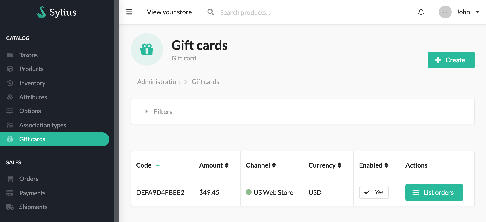
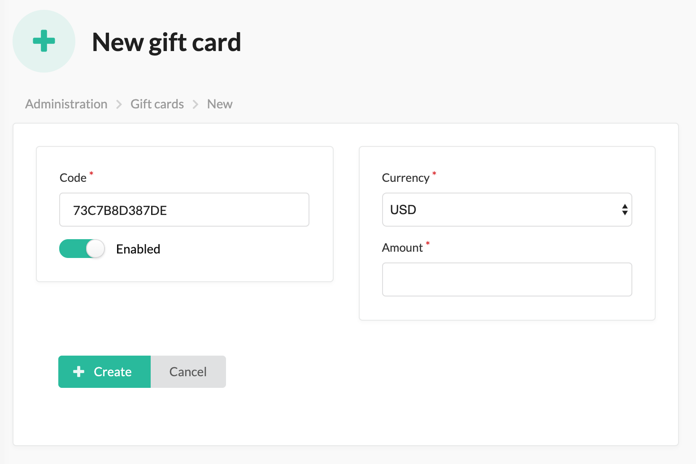

# Sylius Gift Card Plugin

[![Latest Version on Packagist][ico-version]][link-packagist]
[![Software License][ico-license]](LICENSE)
[![Build Status][ico-travis]][link-travis]
[![Quality Score][ico-code-quality]][link-code-quality]

## Screenshots





## Installation

### Require plugin with composer:

```bash
$ composer require setono/sylius-gift-card-plugin
```

### Import configuration:

```yaml
# config/packages/_sylius.yaml
imports:
    # ...
    - { resource: "@SetonoSyliusGiftCardPlugin/Resources/config/app/config.yaml" }
```

### (Optional) Import fixtures 

If you wish to have some gift cards to play with in your application during development.

```yaml
# config/packages/_sylius.yaml
imports:
    # ...
    - { resource: "@SetonoSyliusGiftCardPlugin/Resources/config/app/fixtures.yaml" }
```

### Import routing:
   
```yaml
# config/routes.yaml
setono_sylius_gift_card:
    resource: "@SetonoSyliusGiftCardPlugin/Resources/config/routes.yaml"
```

### Add plugin class to your `bundles.php`:

Make sure you add it before `SyliusGridBundle`, otherwise you'll get
`You have requested a non-existent parameter "setono_sylius_gift_card.model.gift_card.class".` exception.

```php
<?php
$bundles = [
    // ...
    Setono\SyliusGiftCardPlugin\SetonoSyliusGiftCardPlugin::class => ['all' => true],
    Sylius\Bundle\GridBundle\SyliusGridBundle::class => ['all' => true],
    // ...
];
```

### Update your database:

```bash
$ bin/console doctrine:migrations:diff
$ bin/console doctrine:migrations:migrate
```

### Copy templates

- For `SyliusShopBundle`:

```bash
mkdir -p templates/bundles/SyliusShopBundle
cp -r vendor/setono/sylius-gift-card-plugin/tests/Application/templates/bundles/SyliusShopBundle/ \
   templates/bundles/SyliusShopBundle/
```

- For `SyliusAdminBundle`:

```bash
mkdir -p templates/bundles/SyliusAdminBundle
cp -r vendor/setono/sylius-gift-card-plugin/tests/Application/templates/bundles/SyliusAdminBundle/ \
   templates/bundles/SyliusAdminBundle/
```

### Override `Order` and `OrderRepository`

**Override `Order`**

```php
<?php

# src/Entity/Order.php

declare(strict_types=1);

namespace App\Entity;

use Setono\SyliusGiftCardPlugin\Model\OrderInterface as SetonoSyliusGiftCardPluginOrderInterface;
use Setono\SyliusGiftCardPlugin\Model\OrderTrait as SetonoSyliusGiftCardPluginOrderTrait;
use Sylius\Component\Core\Model\Order as BaseOrder;
use Doctrine\ORM\Mapping as ORM;

/**
 * @ORM\Entity
 * @ORM\Table(name="sylius_order")
 */
class Order extends BaseOrder implements SetonoSyliusGiftCardPluginOrderInterface
{
    use SetonoSyliusGiftCardPluginOrderTrait;
}
```
    
**Override `OrderRepository`:*

```php
<?php

# src/Doctrine/ORM/OrderRepository.php

declare(strict_types=1);

namespace App\Doctrine\ORM;

use Setono\SyliusGiftCardPlugin\Repository\OrderRepositoryInterface as SetonoSyliusGiftCardPluginOrderRepositoryInterface;
use Setono\SyliusGiftCardPlugin\Doctrine\ORM\OrderRepositoryTrait as SetonoSyliusGiftCardPluginOrderRepositoryTrait;
use Sylius\Bundle\CoreBundle\Doctrine\ORM\OrderRepository as BaseOrderRepository;

class OrderRepository extends BaseOrderRepository implements SetonoSyliusGiftCardPluginOrderRepositoryInterface
{
    use SetonoSyliusGiftCardPluginOrderRepositoryTrait;
}
```

- Add configuration:

```yaml
# config/services.yaml

sylius_order:
    resources:
        order:
            classes:
                model: App\Entity\Order
                repository: App\Doctrine\ORM\OrderRepository

```

### Install assets:

```bash
$ php bin/console assets:install --symlink web
```

### Clear cache:

```bash
$ php bin/console cache:clear
```
    
# Development

## Testing

```bash
$ composer tests
```

## Playing

- To run built-in application showing plugin at work, just run:  

```bash
$ composer try
```

## Contribution

Learn more about our contribution workflow on http://docs.sylius.org/en/latest/contributing/.

Please, run `composer all` to run all checks and tests before making pull request.

[ico-version]: https://img.shields.io/packagist/v/setono/sylius-gift-card-plugin.svg?style=flat-square
[ico-license]: https://img.shields.io/badge/license-MIT-brightgreen.svg?style=flat-square
[ico-travis]: https://img.shields.io/travis/Setono/SyliusGiftCardPlugin/master.svg?style=flat-square
[ico-code-quality]: https://img.shields.io/scrutinizer/g/Setono/SyliusGiftCardPlugin.svg?style=flat-square

[link-packagist]: https://packagist.org/packages/setono/sylius-gift-card-plugin
[link-travis]: https://travis-ci.org/Setono/SyliusGiftCardPlugin
[link-code-quality]: https://scrutinizer-ci.com/g/Setono/SyliusGiftCardPlugin
